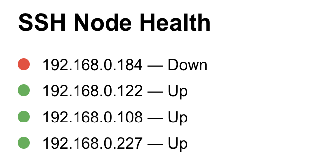
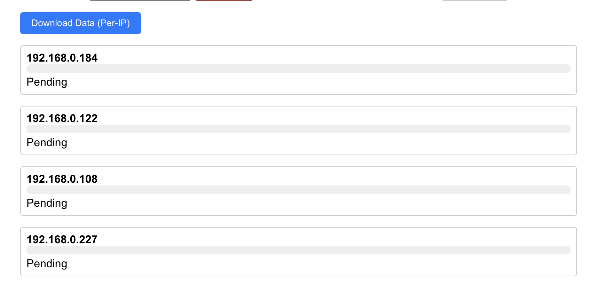

# StreetAware Project Documentation

## 1. Manual Data Collection

1. Clone the SSH script repository:

   ```
   git clone https://github.com/harishbalajib/StreetAwareV2
   ```

2. Power on the camera and sensors, and ensure they're connected to AC power.

3. Enable the **Global Time Sync Module**.

4. Connect to the same network/router as the sensors.

5. Run the SSH multi-run script:

   ```
   python ssh_multiple_run_script.py
   ```

6. Wait for ~10 minutes (or based on the required data collection duration).

7. Terminate the script manually:

   ```
   Ctrl + C
   ```

8. SSH into the sensor's IP (or use **RealVNC Viewer** for interactive mode).

9. To find the sensor IP:
   - Navigate to: `192.168.0.0`
   - Login to the router using the set credentials.
   - Identify the connected device IPs from the router dashboard.

10. Navigate to the `/Data` directory on the sensor.

11. Copy the sensor output for the required date:
    - Use `scp` from terminal:
      ```
      scp user@<sensor-ip>:/path/to/Data/<date-folder> ./local-folder
      ```
    - Or use drag and drop in interactive mode.

12. Upload the collected data to the **Research Space for StreetAware**.

---

## 2. App Setup - Manual

### Clone the repository:

```
git clone https://github.com/exploring-curiosity/StreetAwareApp
```

### Frontend Setup

```
cd street-aware-app
npm i
```

### Backend Setup

```
cd street-aware-service
python -m venv myenv
source myenv/bin/activate
pip install -r requirements.txt
```

### Scripts Setup

```
cd street-aware-scripts
source myenv/bin/activate
pip install -r requirements.txt
```

---

## 3. App Run - Manual

### Start Frontend

```
cd street-aware-app
npm run start
```

### Start Backend

```
cd street-aware-service
source myenv/bin/activate
python app.py
```

### Run Scripts

```
cd street-aware-scripts
source myenv/bin/activate
# Run scripts as required
```

---

## 4. App Setup - Bash Script

### Clone the repository:

```
git clone https://github.com/exploring-curiosity/StreetAwareApp
```

### Make scripts executable:

```
chmod +x setup.sh run.sh stop.sh
```

### Run setup:

```
./setup.sh
```

---

## 5. App Run - Bash Script

### Start the app:

```
./run.sh
```

### Stop the app:

```
./stop.sh
```

...

## 6. How to Use the App

### ✅ Health Check

The app includes a UI section for **health checks**. Below is a sample image indicating what the health check screen looks like. This helps verify if sensors are connected and responsive.



---

### ✅ Collect Data

To begin collecting sensor data:

1. In the **Collect Data** section of the app UI, set a value (in seconds) for:
   - **Total Collection Duration**
   - **Session Timeout**

2. Click the **Start SSH & Collect** button.

3. To stop data collection manually before timeout, use the **Stop Job** button.


---

### ✅ Download Data to Local Device

After the collection is complete:



- Click on **Download Data (per-ip)**.
- This will fetch sensor data to your local machine.

Downloaded data is stored at:

```
street-aware-scripts/data/<current-date>
```

You can then upload the collected data to the **Research Space** for archival or future analysis.

---

## 7. Find Original Doc for Latest Updates

For the most up-to-date documentation and updates, refer to the following Google Doc:

👉 [StreetAware Master Documentation](https://docs.google.com/document/d/1m13t26RZbAX_EhKLEvc13xLq-o2AdOja44-rMRILN5U/edit?usp=sharing)

---

